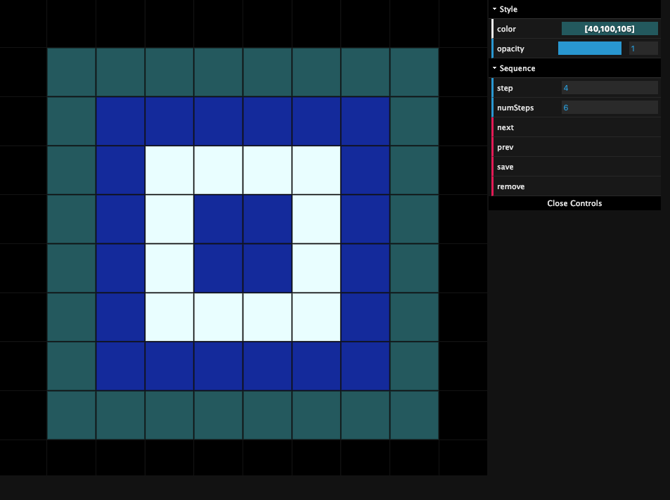

# Starfield
## Burn in the Forest 2019




This is the code for the Starfield project. There are two parts:

1. Arduino-based light controller: listens on port 9600 for sequences of light values and instructs the lights to change to those values
2. Computer-based server: hosts the GUI controller and communicates with starfield panel via either serial port or bonjour connection

# Arduino light controller

Code for this is in 'arduino' folder.

To run, simply plug in an Arduino into a USB port, open the Arduino editor, and upload the code.

You will need to wire your arduino to an Adafruit 36mm Square 12V Digital RGB Pixels strand with WS2801 controller

Example: https://www.adafruit.com/product/683

Wire the LED data pin to port 2 and clock pin to port 3 on the arduino

Four variants are provided:

- `starfield-arduino.ino`: Receives commands from the `controller.js` via the 9600 baud serial port
- `arduino-failsafe-white.ino`: Shows a static white light; does not require computer
- `arduino-failsafe-white-alt.ino`: Shows a static white light (alternative); does not require computer
- `arduino-failsafe-color.ino`: Shows a changing wheel of color; does not require computer

# Server

## GUI Controller

The server creates a simple web server that renders the Controller UI. This client-side code is responsible for generating the light sequence.

To launch the GUI controller, type `npm run server` and then point your browser to `http://localhost:3000`

## Server - Ceiling Communication

The creates a websocket server listens for `render` commands. These `render` commands should include an array of led values. The server will relay these on to the ceiling using either the `ArduinoPanelManager` or `BonjourPanelManager` panel manager classes (used to talk to the starfield ceiling).

The code to create this socket connection is as follows:

```var io = require('socket.io')(server);
io.on('connection', (newSocket) => { 
    newSocket.on('render', (ledMatrix) => {
        panelManager.send(ledMatrix);
    });
});```


### ArduinoPanelManager

Used to communicate with Arduino-powered panel over serial port. Configure the serial address and baud rate when setting up the panel. The `ledsPerPanel` option will duplicate each color value in the array by that number of times, so every LED in each panel is the same. This code can be extended in the future to allow for a funkier star effect.

Example:

```// initialize arduino panel manager
var ArduinoPanelManager = require('./modules/arduinoPanelManager.js');
var panelManager = new ArduinoPanelManager({
    path: '/dev/ttyS3', 
    baudRate: 9600, 
    ledsPerPanel: 2
});
```

### BonjourPanelManager

Used to communicate with Raspberry-PI powered panel over local network Bonjour discovery. An example bonjour client panel is available in the `bonjourClient/panel.js` code

Example:

```// initialize bonjour panel manager
var {BonjourPanelManager} = require('./modules/bonjourPanelManager.js');
var panelManager = new BonjourPanelManager(2, 4);```


# Notes

If you want to compile to Arduino from the command line (e.g. editing in an IDE) you can do so by calling the arduino executable with the `--upload` and `--port` params. EG:

`arduino.exe --upload ~\starfield-arduino\starfield-arduino.ino --port COM3`


# TODO

TODO: animating between old and new values
TODO: two LEDs per ceiling
TODO: effects for two LEDs
